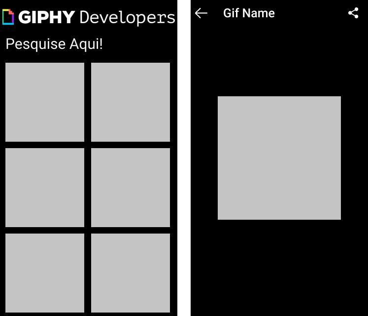

# Gif Finder with Flutter

---

A gif searcher developed in flutter that allows you to search for gifs and share them on other platforms. Inspired by application #5 of Daniel Ciolfi's course.

 

## Features

- **Flutter** -  A framework developed by Google in the Dart language.

## Getting Started

1. Clone this repo using `git clone https://github.com/felipebufelli/gif_finder.git`
2. Move yourself to the appropriate directory: `cd gif_finder`
3. Run `flutter run` to start the mobile app.

Note: If you choose to start the mobile app in the android emulator, you will have to start the emulator before.
